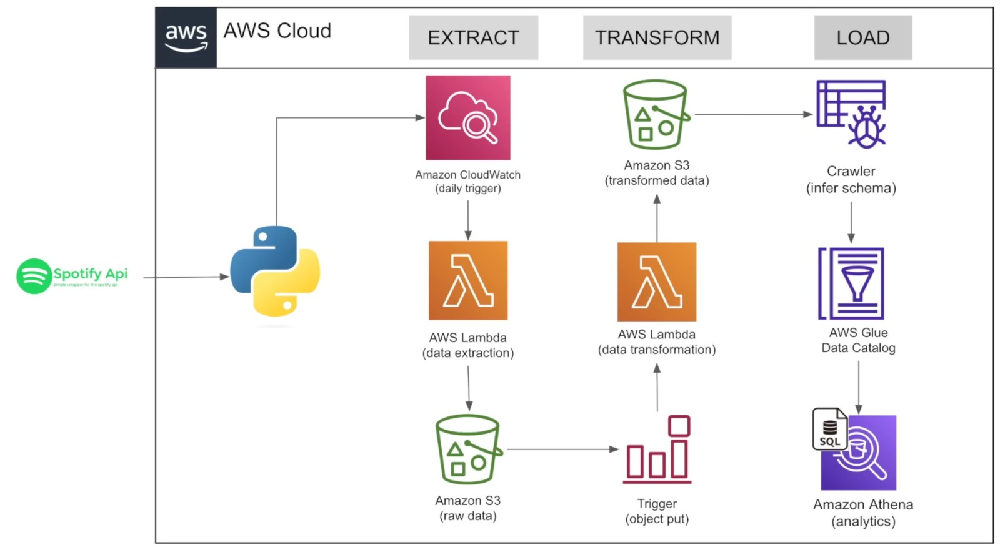

## 📍 Emden, Germany
<td>Google Maps </td>
📞  [Teams] ✉️ [Email: Sai-Swaroop.Gali@outlook.com](mailto:Sai-Swaroop.Gali@outlook.com)

🔗 [LinkedIn: Sai Swaroop Gali](https://www.linkedin.com/in/sai-swaroop-gali/)  👨‍💻 [GitHub: Sai Swaroop Gali](https://github.com/SaiSwaroop-Gali)

## Projects
[**Spotify Data pipeline (ETL)**](https://github.com/MaheedharAttaluri/Spotify-ETL.git)

**Tech Stack:** Python, AWS (Lambda, Cloud watch, S3, Trigger, Crawler, Glue, Athena)

•	Extracted Spotify API data using Python and automated extraction to AWS Lambda for efficient processing and storage

•	Configured AWS Lambda with triggers set to execute every one-minute, channelling new data to an S3 bucket for uninterrupted data ingestion

•	Initiated data transformation with S3 triggers and Lambda to sort data into designated bucket folders

•	Enabled an AWS Glue crawler to update the Glue Data Catalog automatically, allowing for sophisticated querying in Amazon Athena

[**E-Commerce Data Modelling and Analytics**](https://github.com/MaheedharAttaluri/Instakart-Data-Analysis)

**Tech Stack:** PostgreSQL, Python

•	Performed exploratory data analysis on the Instacart dataset using Python, to understand consumer purchase patterns

•	Developed an E-commerce data model and established a PostgreSQL database to streamline analytics

•	Generated PostgreSQL tables with Python queries, streamlining data insertion using psycopg2 and sqlalchemy packages

•	Executed Analytic Queries in PostgreSQL to extract key insights on order frequencies, product popularity, and temporal shopping patterns

[**YouTube Trending Video Dataset Visualization**](https://github.com/MaheedharAttaluri/YouTube-Treanding-Video-Analytics-)

**Tech Stack: Microsoft PowerBI**

•	Developed an interactive Power BI dashboard to visualize global YouTube trending video data, integrating slicers and varied visualizations to provide in-depth, 
  exploration of key viewership metrics

•	Applied DAX queries within Power BI for in-depth analysis of YouTube video trends, focusing on detailed user engagement and viewership dynamics

[**Labor Market & GDP predictions**](https://github.com/MaheedharAttaluri/Labor-Market-GDP-Prediction) 

**Tech Stack:** Python, Machine Learning models

•	Analysed FRED API data using Python and machine learning, identifying Consumer Price Index (CPI) as key influence in consumer spending to enhance economic forecasting

•	Applied Principal Component Analysis and time series analysis to enhance the accuracy and robustness of models predicting labor market and GDP trends.

[**Stock-Market-Prediction**](https://github.com/MaheedharAttaluri/Stock-Market-Prediction)

[**Live-Data-Analysis-using-Kafka**](https://github.com/MaheedharAttaluri/Live-Data-Analysis-using-Kafka)

**Tech Stack:** Python,Kafka, AWS (EC2, S3, Crawler, Glue, Athena)

•	Stock prices are extracted in real-time using the Finhub API and streamed into Kafka. A custom Python script functions as a producer, efficiently 
  pushing the data into Kafka topics.

•	The data flow is managed by Kafka, supported by ZooKeeper, ensuring robust data handling. Both Kafka broker and ZooKeeper are hosted on AWS EC2 
  instances to effectively manage the processing load.

•	After processing, the data is stored in AWS S3, providing a scalable and secure storage solution that acts as a data lake for further processing 
  and analysis.

•	AWS Glue catalogs the data in S3, creating searchable metadata and schemas. This structured data is then queried using Amazon Athena, allowing for 
  advanced SQL-based analysis directly from the data lake.

## Skills and Competencies

**Programming Languages:** Python, R, HTML, SQL, MATLAB	

**Developer Tools:** VS code, Cloud (Amazon Web Services), Anaconda, Microsoft PowerBI, Origin Pro

**Technologies:** GitHub, Data Bricks, MS Office (Excel, Word & PowerPoint), Apache Spark

**Project Management Softwares:** Asana, Jira

**Personal competence:** Self-motivated, Willingness to perform, Good communication & teamwork skills      

**Languages:** English, German, Telugu 

**Interpersonal Skills**: Team Work, Commitment, Individual, Communication, Flexible

**Technical Competencies**: Resource planning, Market Research, Analytical Skills, Design Thinking.

**Hobbies**: Trekking, Volley ball, Listening music

## Certifications

**Amazon Web Services (AWS):** AWS Certified `Cloud Practitioner

**365 Data Science:** Python, Power BI, Tableau

**Coursera:** Data Visualization and Dashboards with Excel and Cognos, Introduction to Data Analytics

## Educational Career

### M.Sc. Engineering Management - Major: Data Analytics - Wichita State University, USA January 2023 – May 2024

Focus: Machine Learning, Big Data Analytics, Applied Data Science

M.Sc. Metallic Materials Technology - TU Bergakademie Freiberg, Germany (April 2019 – November 2022)

Focus: Additive Manufacturing, Project Management, Operations Management

B.TECH. Mechanical engineering - Jawaharlal Nehru Technological University, India (August 2014 - April 2018)  

Focus:  Industrial Management, Manufacturing Automation, Process Design

## Professional Career

**Employer:** National Institute for Aviation Research, Wichita, USA                                                           April 2023 – Present

**Graduate Assistant & Data Research Analyst**

•	Developing and maintaining Microsoft SQL database for additive manufacturing analytics, enhancing query performance and data integrity for critical performance 
  metrics evaluation
  
•	Implementing different machine learning models to accurately predict the simulation results of additive manufactured components

•	Creating interactive dashboards to visualizing mechanical properties data

**Softwares:** 3D Experience, Python, Power BI, Microsoft SQL

**Employer:**  Fraunhofer IGCV Research Institute, Munich, Germany                                     January 2022 – November 2022

**Student Research Assistant**

•	Performed in-depth data analytics on Die-casting experimental data using Origin Pro software to effectively visualize key manufacturing metrics, aiding in strategic decision-making.

•	Applied statistical techniques, like correlation analysis, to streamline automotive parts production, enhancing operational efficiency.

**Softwares:** Origin pro, Siemens NX 

**Employer:** Volkswagen AG/Audi AG, Germany                                                            

**Internship in Technology Development Casting**                                                        May 2021 – October 2021 

•	Coordinated cross-functional teams using Asana tool to align production management with data analysis insights, enhancing efficiency and quality in technology development cycles

•	Optimized automotive component design in CATIA V5 software, utilizing regression analysis and variance testing to ensure design accuracy and performance consistency

**Work student in Quality Assurance Department**                                                         March 2021 – May 2021

•	Streamlined Assembly workflows with process mapping, adhering to automotive quality standards and generating component analysis reports

**Softwares:** Catia V5, Asana, Miro 
