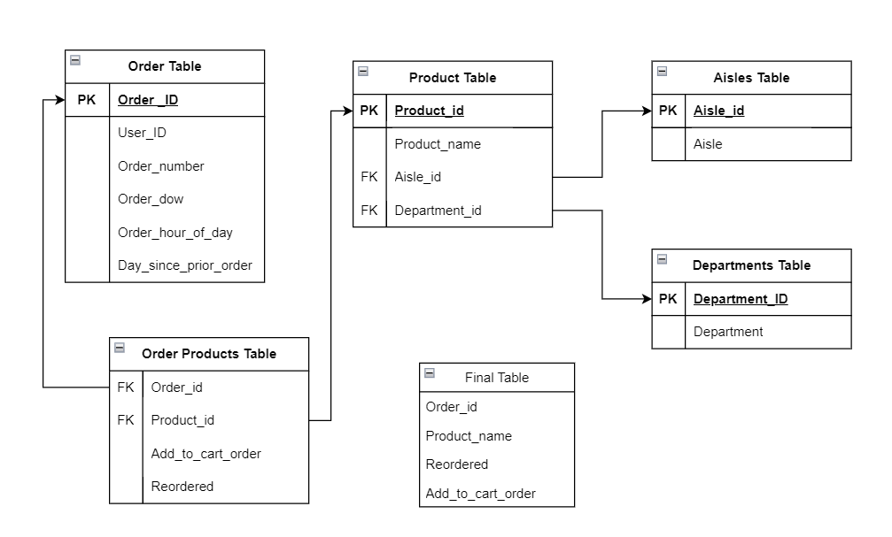
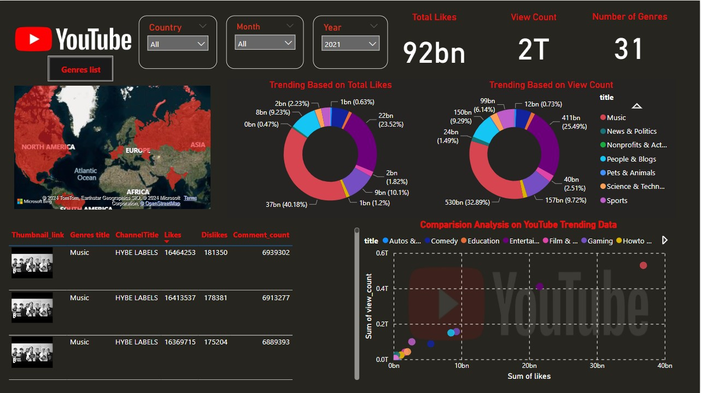
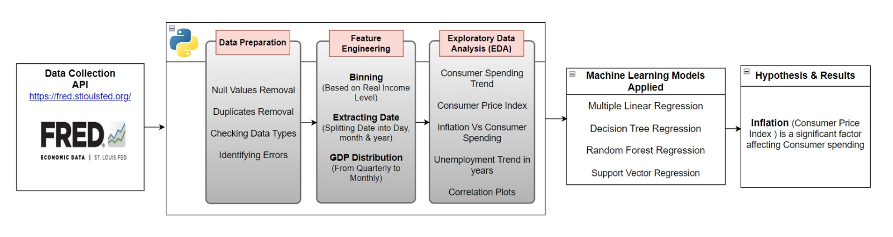

## 📍Emden, Germany
✉️ [Email: Sai-Swaroop.Gali@outlook.com](mailto:Sai-Swaroop.Gali@outlook.com)

🔗 [LinkedIn: Sai Swaroop Gali](https://www.linkedin.com/in/sai-swaroop-gali/)  👨‍💻 [GitHub: Sai Swaroop Gali](https://github.com/SaiSwaroop-Gali)

## Projects
[**Spotify Data pipeline (ETL)**](https://github.com/SaiSwaroop-Gali/Spotify-E-T-L-Pipeline)

**Tech Stack:** Python, AWS (Lambda, Cloud watch, S3, Trigger, Crawler, Glue, Athena)

•	Extracted Spotify API data using Python and automated extraction to AWS Lambda for efficient processing and storage

•	Configured AWS Lambda with triggers set to execute every one-minute, channelling new data to an S3 bucket for uninterrupted data ingestion

•	Initiated data transformation with S3 triggers and Lambda to sort data into designated bucket folders

•	Enabled an AWS Glue crawler to update the Glue Data Catalog automatically, allowing for sophisticated querying in Amazon Athena

[**Analysis on Instacart Data**](https://github.com/SaiSwaroop-Gali/Analysis-on-Instacart_data)

**Tech Stack:** PostgreSQL, Python

•	Performed exploratory data analysis on the Instacart dataset using Python, to understand consumer purchase patterns

•	Developed an E-commerce data model and established a PostgreSQL database to streamline analytics

•	Generated PostgreSQL tables with Python queries, streamlining data insertion using psycopg2 and sqlalchemy packages

•	Executed Analytic Queries in PostgreSQL to extract key insights on order frequencies, product popularity, and temporal shopping patterns

[**YouTube Top Trending Videos Analysis**](https://github.com/SaiSwaroop-Gali/YouTube-Trending-Videos-Analysis)

**Tech Stack: Microsoft PowerBI**

•	Developed an interactive Power BI dashboard to visualize global YouTube trending video data, integrating slicers and varied visualizations to provide in-depth, exploration of key viewership metrics

•	Applied DAX queries within Power BI for in-depth analysis of YouTube video trends, focusing on detailed user engagement and viewership dynamics

[**Labor Market & GDP predictions**](https://github.com/MaheedharAttaluri/Labor-Market-GDP-Prediction) 

**Tech Stack:** Python, Machine Learning models

• Analyzed FRED API data with Python and machine learning, identifying Consumer Price Index (CPI) as key influence in consumer spending to enhance forecasting, showcasing prediction skills 
  relevant to BI development.

• Applied Principal Component Analysis and time series analysis to enhance the accuracy and robustness of models predicting labor market and GDP trends

 
[**E-T-L Pipeline to perform Data analysis and prediction on stock-market data**](https://github.com/SaiSwaroop-Gali/E-T-L-pipeline-to-perform-data-analysis-on-stock-market-data)

**Tech Stack:** Python, Jupyter Notebook, AWS Cloud Architecture

• Automated ETL pipeline capable of handling dynamic inputs, reduced manual data processing time by 70% and streamlining financial metric calculations.

• Developed a Timeseries model which achieved prediction accuracy within 5% error margin of actual stock prices for the initial 5-day forecast period.

• Proposed cloud-based architecture enhanced data processing scalability by 80% and reduced latency by 40%, using AWS services.

[**Kafka Live Data Extraction**](https://github.com/SaiSwaroop-Gali/Kafka-Live-Data-Extraction)

**Tech Stack:** Python,Kafka, AWS (EC2, S3, Crawler, Glue, Athena)

• Extracted real-time stock prices using Finnhub API and streamed into Kafka with a custom Python script as the producer.

• Managed data flow with Kafka and Zookeeper, hosted on AWS EC2 instances for robust data handling and stored processed data in AWS S3, acting as a scalable and secure data warehouse.

• Catalogued data in S3 using AWS Glue, creating searchable metadata and schemas, and queried structured data with Amazon Athena for advanced SQL-based analysis.

## Skills and Competencies

**Programming Languages:** Python, R, HTML, SQL, MATLAB	

**Developer Tools:** VS code, Cloud (Amazon Web Services), Anaconda, Microsoft PowerBI, Origin Pro

**Technologies:** GitHub, Data Bricks, MS Office (Excel, Word & PowerPoint), Apache Spark

**Project Management Softwares:** Asana, Jira

**Personal competence:** Self-motivated, Willingness to perform, Good communication & teamwork skills      

**Languages:** English, German, Telugu 

**Interpersonal Skills**: Team Work, Commitment, Individual, Communication, Flexible

**Technical Competencies**: Resource planning, Market Research, Analytical Skills, Design Thinking.

**Hobbies**: Trekking, Volley ball, Listening music

## Certifications

**Amazon Web Services (AWS):** AWS Certified `Cloud Practitioner

**365 Data Science:** Python, Power BI, Tableau

**Coursera:** Data Visualization and Dashboards with Excel and Cognos, Introduction to Data Analytics

## Educational Career

### M.Sc. Engineering Management - Major: Data Analytics - Wichita State University, USA January 2023 – May 2024

Focus: Machine Learning, Big Data Analytics, Applied Data Science

M.Sc. Metallic Materials Technology - TU Bergakademie Freiberg, Germany (April 2019 – November 2022)

Focus: Additive Manufacturing, Project Management, Operations Management

B.TECH. Mechanical engineering - Jawaharlal Nehru Technological University, India (August 2014 - April 2018)  

Focus:  Industrial Management, Manufacturing Automation, Process Design

## Professional Career

**Employer:** National Institute for Aviation Research, Wichita, USA                                                           April 2023 – Present

**Graduate Assistant & Data Research Analyst**

•	Developing and maintaining Microsoft SQL database for additive manufacturing analytics, enhancing query performance and data integrity for critical performance 
  metrics evaluation
  
•	Implementing different machine learning models to accurately predict the simulation results of additive manufactured components

•	Creating interactive dashboards to visualizing mechanical properties data

**Softwares:** 3D Experience, Python, Power BI, Microsoft SQL

**Employer:**  Fraunhofer IGCV Research Institute, Munich, Germany                                     January 2022 – November 2022

**Student Research Assistant**

•	Performed in-depth data analytics on Die-casting experimental data using Origin Pro software to effectively visualize key manufacturing metrics, aiding in strategic decision-making.

•	Applied statistical techniques, like correlation analysis, to streamline automotive parts production, enhancing operational efficiency.

**Softwares:** Origin pro, Siemens NX 

**Employer:** Volkswagen AG/Audi AG, Germany                                                            

**Internship in Technology Development Casting**                                                        May 2021 – October 2021 

•	Coordinated cross-functional teams using Asana tool to align production management with data analysis insights, enhancing efficiency and quality in technology development cycles

•	Optimized automotive component design in CATIA V5 software, utilizing regression analysis and variance testing to ensure design accuracy and performance consistency

**Work student in Quality Assurance Department**                                                         March 2021 – May 2021

•	Streamlined Assembly workflows with process mapping, adhering to automotive quality standards and generating component analysis reports

**Softwares:** Catia V5, Asana, Miro 
