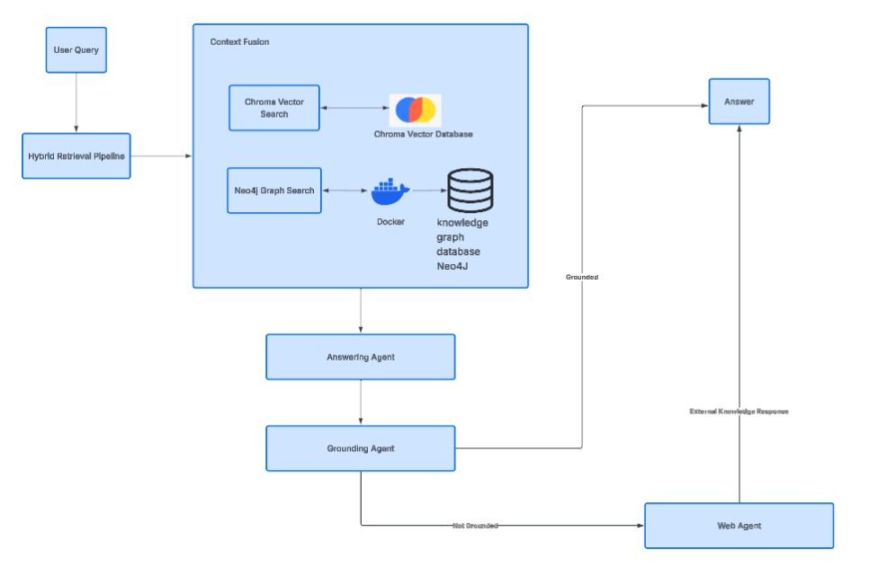
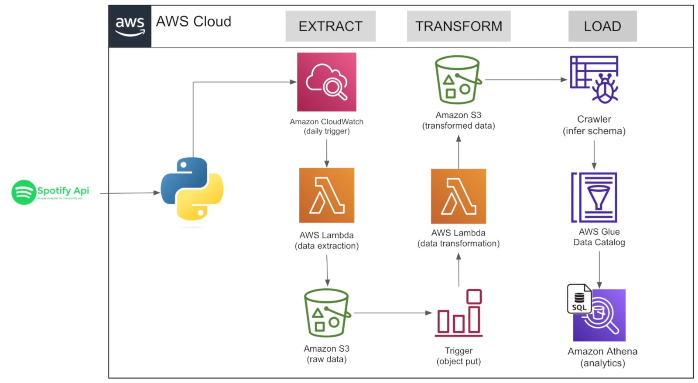
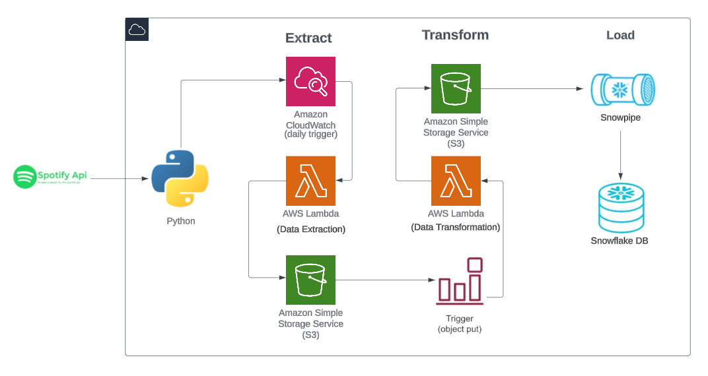
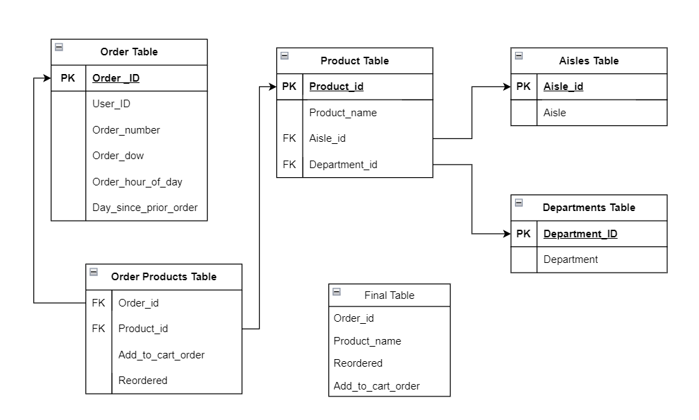
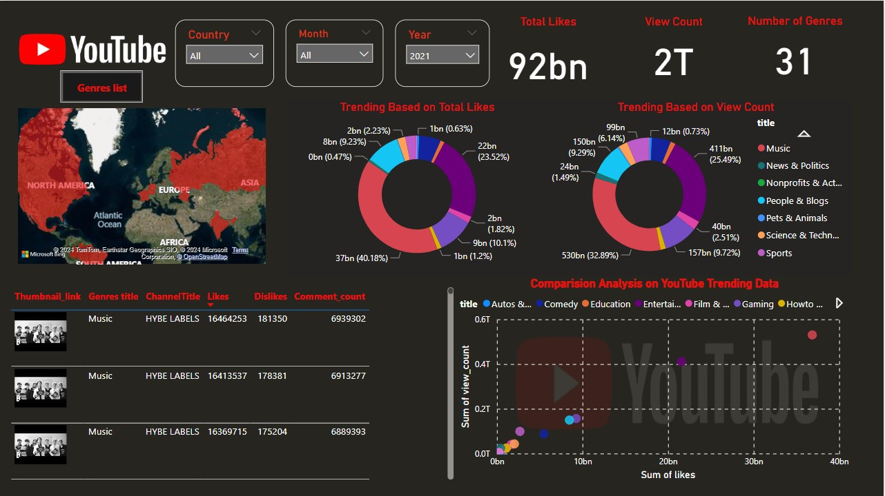
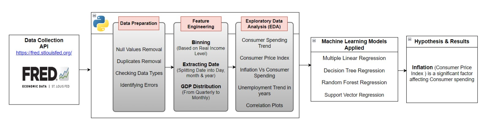
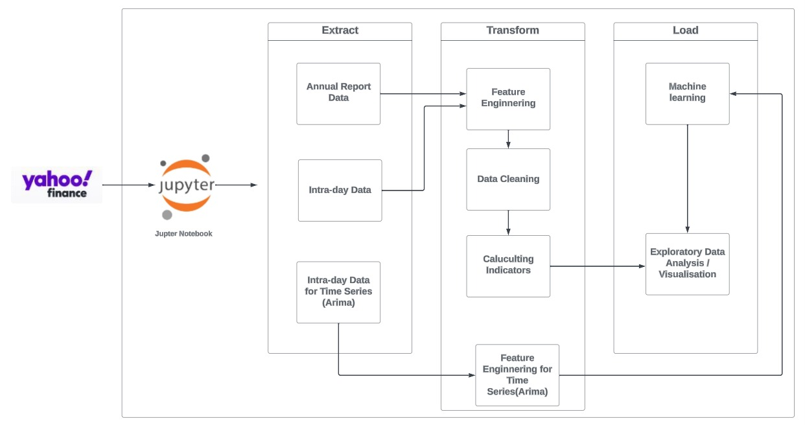
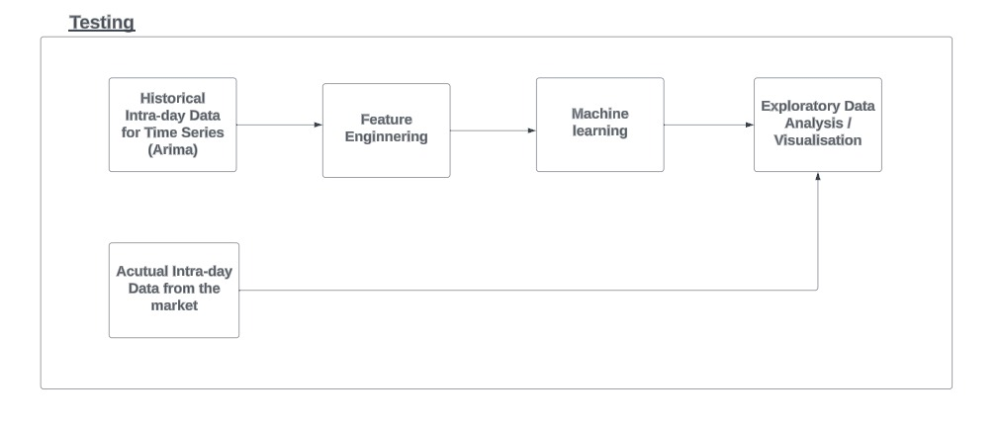
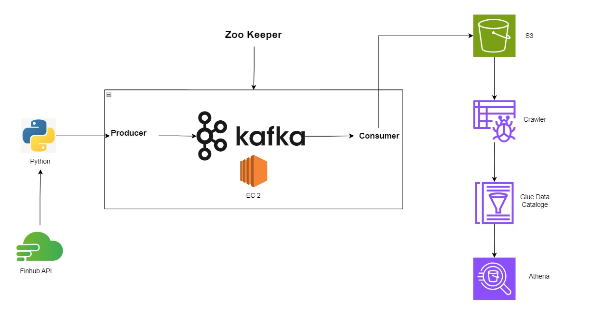

## 📍Koblenz, Germany
✉️ [Email: Sai-Swaroop.Gali@outlook.com](mailto:Sai-Swaroop.Gali@outlook.com)

🔗 [LinkedIn: Sai Swaroop Gali](https://www.linkedin.com/in/sai-swaroop-gali/)  👨‍💻 [GitHub: Sai Swaroop Gali](https://github.com/SaiSwaroop-Gali)

## 🗂️ Projects
[**Procurement Agent (Multi-Agent Workflow with Human-in-the-Loop)**](https://github.com/SaiSwaroop-Gali/Procurement-agent)

**Tech Stack:**  Python, Google Gemini 2.5 Flash, SQLite, Streamlit, Telegram Bot API, Gmail SMTP/IMAP

• Built a 3-agent HITL procurement system (Procurement, Manager, Supplier-Response agents) coordinating via Telegram, Gmail, 
and a shared SQLite database to route purchase decisions through human approval.  

• Powered Manager and Supplier-Response agents with Gemini 2.5 Flash to interpret natural-language instructions and verify 
supplier replies, using deterministic tools for email generation to eliminate hallucination risk. 

• Built a real-time Streamlit dashboard backed by SQLite for persistent storage, giving full visibility into order status, agent 
decisions, and supplier responses across the workflow.

[**Hybrid Graph RAG Research Assistant (Multi-model data extraction)**](https://github.com/SaiSwaroop-Gali/Procurement-agent)

**Tech Stack:**  Python, LangChain, Neo4j, ChromaDB, OpenAI GPT, text-embedding-3-small, Gemma 4 31B (OpenRouter), Docker 

• Built an end-to-end Hybrid Graph Retrieval-Augmented Generation (RAG) system combining ChromaDB vector search and Neo4j 
knowledge graph retrieval to answer domain-specific questions from AI research papers, leveraging multimodal document 
processing (text, tables, and images). 

• Designed an agentic LLM pipeline with semantic chunking, knowledge graph extraction, context fusion, grounding verification, and 
an LLM-based Web Agent to improve answer reliability and handle out-of-domain queries. 

• Developed an evaluation and observability framework featuring automated benchmark harnesses, telemetry logging, retrieval 
analytics, and failure analysis to evaluate retrieval quality and continuously improve pipeline performance. 

[**Spotify Data pipeline (ETL)**](https://github.com/SaiSwaroop-Gali/Spotify-E-T-L-Pipeline)

**Tech Stack:** Python, AWS (Lambda, Cloud watch, S3, Trigger, Crawler, Glue, Athena)

•	Developed an ETL pipeline for Spotify's data handling, empowering music insights and enhancing accessibility to trends.

•	Used AWS Lambda functions to automate data extraction from Spotify API, reducing manual data handling by 35% and showcasing data profiling skills.

•	Optimized data transformation with S3 triggers and AWS Lambda, leading to the improvement in data sorting, optimization, and retrieval, thus enhancing data accessibility.

•	Automated data identification and retrieval processes from S3 to Athena using Glue Data Catalog with crawlers, and from S3 to Snowflake DB using Snowpipe.

[**Analysis on Instacart Data**](https://github.com/SaiSwaroop-Gali/Analysis-on-Instacart_data)

**Tech Stack:** PostgreSQL, Python

•	Conducted exploratory data analysis on the Instacart dataset to uncover consumer purchase patterns, handling over 3 million orders to enhance data-driven decision-making.

•	Developed a robust data model by establishing a PostgreSQL database, improving query execution speed by 20%.

•	Generated PostgreSQL tables with Python queries, streamlined data insertion using psycopg2 and SQLAlchemy packages, reducing data processing time by 25%.

•	Executed analytic queries in PostgreSQL to extract key insights on order frequencies, product popularity, and temporal shopping patterns.

[**YouTube Top Trending Videos Analysis**](https://github.com/SaiSwaroop-Gali/YouTube-Trending-Videos-Analysis)

**Tech Stack: Microsoft PowerBI**

• Developed an interactive Power BI dashboard to visualize the global YouTube trending video dataset, assisting content creators in refining their content strategies for better viewership.

• Implemented DAX measures for calculations on YouTube video trend analysis to effectively display key metrics.

• Created a BI report using custom visuals like stacked bars, donut charts, line charts, cards, slicers, bookmarks, etc.

[**Labor Market & GDP predictions**](https://github.com/SaiSwaroop-Gali/Labor-Market-USA-GDP-Prediction)

**Tech Stack:** Python, Machine Learning models

• Extracted and analyzed economic indicators from the FRED API, identifying key factors influencing consumer spending to enhance economic forecasting and decision-making.

• Applied feature engineering and machine learning models, optimizing predictive accuracy for labor market and GDP trends, contributing to informed business and policy decisions.

 
[**E-T-L Pipeline to perform Data analysis and prediction on stock-market data**](https://github.com/SaiSwaroop-Gali/E-T-L-pipeline-to-perform-data-analysis-on-stock-market-data)

**Tech Stack:** Python, Jupyter Notebook, AWS Cloud Architecture

• Automated ETL pipeline capable of handling dynamic inputs, reduced manual data processing time by 70% and streamlining financial metric calculations.

• Developed a Timeseries model which achieved prediction accuracy within 5% error margin of actual stock prices for the initial 5-day forecast period.

• Proposed cloud-based architecture enhanced data processing scalability by 80% and reduced latency by 40%, using AWS services.

[**Kafka Live Data Extraction**](https://github.com/SaiSwaroop-Gali/Kafka-Live-Data-Extraction)

**Tech Stack:** Python,Kafka, AWS (EC2, S3, Crawler, Glue, Athena)

• Extracted real-time stock prices using Finnhub API and streamed into Kafka with a custom Python script as the producer.

• Managed data flow with Kafka and Zookeeper, hosted on AWS EC2 instances for robust data handling and stored processed data in AWS S3, acting as a scalable and secure data warehouse.

• Catalogued data in S3 using AWS Glue, creating searchable metadata and schemas, and queried structured data with Amazon Athena for advanced SQL-based analysis.

## 🎓 Education
### M.Sc. Technical Management | Hochschule Emden/Leer | Germany | Sept 2019 – Mar 2024
**Focus:** Advanced Project management, Applied Statistics, Computer Science, Intelligent Automation

### B.TECH. Mechanical Engineering| Jawaharlal Nehru Technological University | India | Aug 2014 – May 2018
**Focus:** Production Planning & Control, Operations & Research, Industrial Engineering Management

